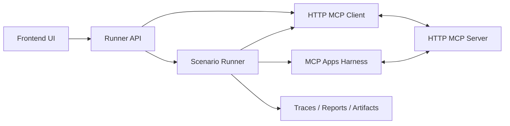
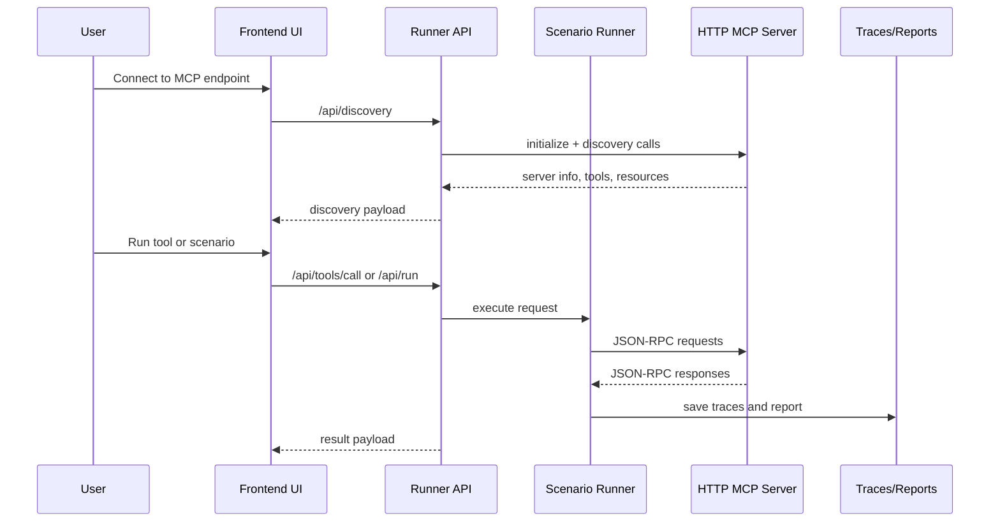

# MCP Testing Workbench

HTTP MCP workbench for:

- live HTTP MCP discovery
- tool and resource inspection
- MCP App preview
- TypeScript-backed scenario suites
- trace capture
- a browser-backed MCP Apps harness

The repo does not include the Sales Analytics MCP server itself. It includes a bundled scenario suite for testing that server.

## Requirements

- Node 20+
- npm
- an HTTP MCP server
- Playwright Chromium for MCP Apps checks

Install Chromium once:

```bash
npx playwright install chromium
```

## Assumptions

- The workbench currently targets HTTP MCP servers. It does not support stdio yet.
- The HTTP client targets Streamable HTTP MCP servers. It does not yet implement the legacy 2024-11-05 HTTP+SSE compatibility path.
- Authenticated MCP servers are not supported yet.
- MCP Apps preview in the UI is a lightweight host bridge. The deeper host-flow validation runs through the runner harness.
- For the bundled Sales Analytics demo suite, the reference MCP server is expected to be running at `http://localhost:3000/mcp`.

## Install

```bash
npm install
```

## Run

Start both the frontend and runner API:

```bash
npm run dev
```

This starts:

- frontend: `http://127.0.0.1:5173`
- runner API: `http://127.0.0.1:4177`

## Commands

```bash
npm run run:scenarios
npm run report
npm run typecheck
npm run lint
npm run build
```

## UI Capabilities

The web UI can:

- connect to an HTTP MCP endpoint through the runner API
- load server info, tools, resources, and MCP App surfaces
- call tools and inspect raw responses
- preview MCP App resources with a lightweight host bridge
- list available scenario suites and run them
- inspect saved runs, assertions, and traces

## Runner Capabilities

The runner can:

- initialize and talk to Streamable HTTP MCP servers
- expose discovery, resource-read, tool-call, and run endpoints
- execute TypeScript-backed scenario suites
- record reports, assertions, step timing, and artifacts
- run browser-backed MCP Apps checks through Playwright

To use the runner with an MCP server:

1. Start the target HTTP MCP server.
2. Start this workbench with `npm run dev`, or use the runner API directly.
3. Pass the MCP endpoint as `serverUrl`.
4. Use discovery to inspect the server.
5. Use tool/resource endpoints for manual inspection.
6. Use the run endpoint to execute scenario suites against that server.

## Runner API

The frontend talks to the runner API on `http://127.0.0.1:4177`.

### Health

```bash
curl -s http://127.0.0.1:4177/api/health
```

### List Scenarios

```bash
curl -s http://127.0.0.1:4177/api/scenarios
```

### Discover A Server

```bash
curl -s "http://127.0.0.1:4177/api/discovery?serverUrl=http://localhost:3000/mcp"
```

This returns:

- `serverUrl`
- `initialize`
- `tools`
- `resources`

### Read A Resource

```bash
curl -s "http://127.0.0.1:4177/api/resource?serverUrl=http://localhost:3000/mcp&uri=ui://sample-mcp-apps-chatflow/sales-metric-input-ui"
```

This is useful for:

- previewing raw MCP App HTML
- validating returned UI resources
- debugging resource metadata

### Call A Tool

```bash
curl -s http://127.0.0.1:4177/api/tools/call \
  -H 'content-type: application/json' \
  -d '{
    "serverUrl": "http://localhost:3000/mcp",
    "toolName": "get-sales-data",
    "arguments": {
      "states": ["MH", "TN", "KA"],
      "metric": "revenue",
      "period": "monthly",
      "year": "2025"
    }
  }'
```

This returns:

- `serverUrl`
- `toolName`
- `result`

### Run Scenarios

```bash
curl -s http://127.0.0.1:4177/api/run \
  -H 'content-type: application/json' \
  -d '{
    "serverUrl": "http://localhost:3000/mcp",
    "scenarioIds": ["bootstrap-and-discovery", "fetch-sales-data"]
  }'
```

This returns a run report with:

- overall totals
- per-scenario results
- assertions
- notes
- steps
- artifact paths

### Read Latest Report

```bash
curl -s http://127.0.0.1:4177/api/report/latest
```

### Read Latest Traces

```bash
curl -s http://127.0.0.1:4177/api/traces/latest
```

## Architecture



### Frontend

Location: [frontend](/Users/yashasbhat/Documents/gsoc/gsoc-poc/2026/yashas_bhat_mcp_testing_workbench/frontend)

Responsibilities:

- connect to the runner API
- connect to an HTTP MCP endpoint through the runner
- render discovery data for tools, resources, apps, scenarios, runs, and traces
- invoke tool-backed MCP Apps and preview returned UI resources
- inspect raw responses and saved traces

### Runner

Location: [runner](/Users/yashasbhat/Documents/gsoc/gsoc-poc/2026/yashas_bhat_mcp_testing_workbench/runner)

Responsibilities:

- HTTP MCP client
- scenario execution
- assertions
- trace recording
- MCP Apps Playwright harness
- API routes for the frontend

Key parts:

- [runner/src/client/mcp-http-client.ts](/Users/yashasbhat/Documents/gsoc/gsoc-poc/2026/yashas_bhat_mcp_testing_workbench/runner/src/client/mcp-http-client.ts)
- [runner/src/runner/scenario-runner.ts](/Users/yashasbhat/Documents/gsoc/gsoc-poc/2026/yashas_bhat_mcp_testing_workbench/runner/src/runner/scenario-runner.ts)
- [runner/src/apps-harness/mcp-apps-harness.ts](/Users/yashasbhat/Documents/gsoc/gsoc-poc/2026/yashas_bhat_mcp_testing_workbench/runner/src/apps-harness/mcp-apps-harness.ts)
- [runner/src/server/app.ts](/Users/yashasbhat/Documents/gsoc/gsoc-poc/2026/yashas_bhat_mcp_testing_workbench/runner/src/server/app.ts)



### Storage

Saved artifacts go under [traces](/Users/yashasbhat/Documents/gsoc/gsoc-poc/2026/yashas_bhat_mcp_testing_workbench/traces).

This includes:

- latest run report
- per-run MCP traces
- per-run host-app traces
- scenario artifacts

## Current Limits

- no stdio transport
- no legacy 2024-11-05 HTTP+SSE fallback
- no authenticated MCP server support yet
- no persistent connection profiles
- no UI authoring for scenario files yet
- MCP Apps preview in the UI is lighter than the Playwright harness

## Bundled Demo

This repository does not ship with the Sales Analytics MCP server itself.

It does ship with a bundled Sales Analytics MCP Apps scenario suite for the reference server used in the PoC.
